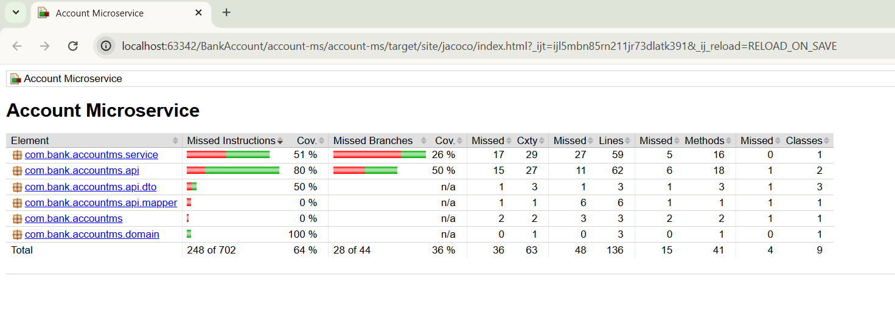
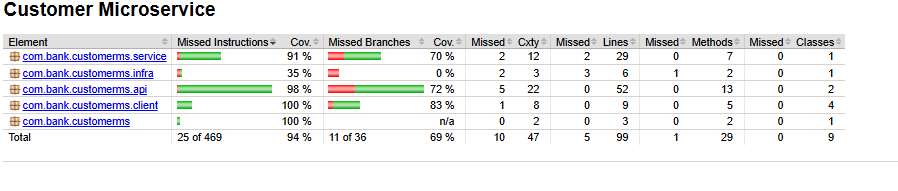
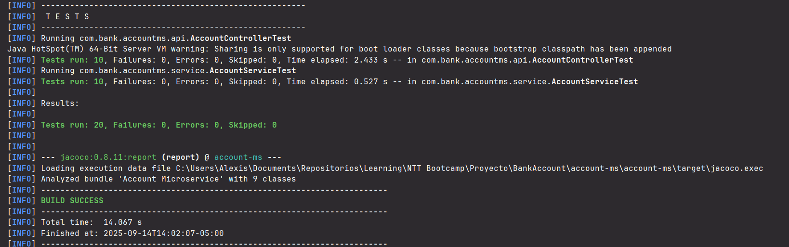
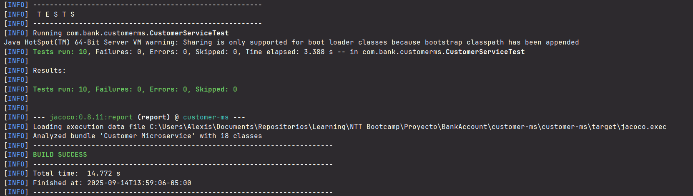

# 🏦 Bank System - Proyecto IV

## 📌 Descripción

Este proyecto forma parte del **Proyecto IV**, el cual extiende las funcionalidades desarrolladas en los entregables anteriores. El contexto es un sistema bancario, incorporando buenas prácticas, patrones de diseño y herramientas de calidad de código.

---

## 🚀 Funcionalidades obligatorias

* [x] Pruebas unitarias con **JUnit** y **Mockito** para los microservicios *Clientes* y *Cuentas*.
* [x] Reporte de cobertura de código con **Jacoco**.
* [x] Aplicación de **Checkstyle**.
* [x] Evaluación y documentación de **principios SOLID** y **patrones de diseño** aplicados.

---

## 📂 Evidencias de calidad

Las evidencias generadas se encuentran en la carpeta [`/documentation/reports`](./documentation/reports):

### 📊 Coverage Reports (JaCoCo)

* 
* 

### 📝 Checkstyle Reports

* [`account-checkstyle-result.xml`](./documentation/reports/checkstyle/account-heckstyle-result.xml)
* [`customer-checkstyle-result.xml`](./documentation/reports/checkstyle/customer-checkstyle-result.xml)

### ✅ Unit Test Results

* 
* 

---
## 📌 Instrucciones de ejecución de reportes

### ▶️ Ejecutar pruebas unitarias con cobertura (Jacoco)

Desde el microservicio correspondiente (ej. *account-ms* o *customer-ms*):

```bash
mvn clean verify
```

Los reportes se generarán en `target/site/jacoco/`.

### ▶️ Ejecutar Checkstyle

```bash
mvn checkstyle:checkstyle
```

El reporte se generará en `target/site/checkstyle.html` o en formato XML dentro de `target/`.

### ▶️ Ejecutar pruebas unitarias (JUnit/Mockito)

```bash
mvn test
```

Los resultados se mostrarán en la consola y en `target/surefire-reports/`.

---

# ✅ Principios SOLID

### S - *Single Responsibility Principle (Principio de Responsabilidad Única)*

En el microservicio **Account** y en **Customer**, tratamos de que cada clase tenga un único rol:

* **Controllers (`AccountController.java`, `CustomerController.java`)** → reciben las solicitudes HTTP y llaman a los servicios.
* **Services (`AccountService.java`, `CustomerService.java`)** → contienen la lógica de negocio.
* **Repositories (`AccountRepository.java`, `CustomerRepository.java`)** → manejan la comunicación con la base de datos.
* **Entities (`Account.java`, `Customer.java`)** → representan las tablas o entidades del dominio.
* **DTOs (`AccountDtos`, `CustomerDtos`)** → definen cómo se envían y reciben los datos.
* **Mappers (`AccountMapper`)** → convierten entre entidades y DTOs.
* **`RestExceptionHandler.java`** → maneja errores de forma separada.

Con esto, cada clase tiene **una sola razón de cambio** y se evita mezclar responsabilidades.

📌 **Mejora posible**: separar cada DTO en un archivo propio en lugar de agruparlos, para que el código sea más claro cuando el proyecto crezca.

---

### O - *Open/Closed Principle (Principio Abierto/Cerrado)*

El código debería poder **extenderse sin tener que modificar lo que ya existe**. En el proyecto se ve en:

* **Repositorios (`AccountRepository`, `CustomerRepository`)** → al heredar de `JpaRepository`, ya tienen métodos listos como `save()`, `findAll()`, etc. Podemos extenderlos con métodos propios sin cambiar lo que ya funciona.
* **Servicios** → la lógica se puede ampliar creando nuevas clases o implementaciones.
* **Controladores** → podemos añadir endpoints sin tocar los anteriores.
* **DTOs y Mappers** → permiten nuevas representaciones sin alterar las entidades.

📌 **Mejora posible**: en `AccountService`, si en el futuro hay reglas distintas para diferentes tipos de cuentas, se podría usar el **Strategy Pattern** para manejar cada regla en su propia clase en lugar de llenar de condicionales el servicio.

---

### L - *Liskov Substitution Principle (Principio de Sustitución de Liskov)*

Este principio dice que **si una clase hereda de otra, debería poder usarse en lugar de la base sin que el programa se rompa**. En el proyecto pasa lo siguiente:

* **Repositorios**: `AccountRepository` y `CustomerRepository` funcionan como `JpaRepository`, por lo que se pueden usar como si fueran ese tipo genérico.
* **Entidades**: `Account` y `Customer` se pueden usar en los servicios sin problemas.
* **Servicios**: se podrían cambiar implementaciones de servicios por otras (ej. `AccountService` → `AccountServiceCached`) sin tener que modificar el resto del sistema.
* **Mappers**: `AccountMapper` devuelve siempre un `AccountDto`, pero podríamos tener otro mapper que haga lo mismo sin romper nada.

📌 **Ejemplo de nuestro código (AccountRepository):**

```java
public interface AccountRepository extends JpaRepository<Account, Long> {
    Optional<Account> findByAccountNumber(String accountNumber);
    List<Account> findByCustomerId(Long customerId);
}
```

📌 **Ejemplo con Mapper (AccountMapper):**

```java
public final class AccountMapper {
    public static AccountDto toDto(Account a) {
        return new AccountDto(
            a.getId(),
            a.getAccountNumber(),
            a.getBalance(),
            a.getAccountType().name(),
            a.getCustomerId()
        );
    }
}
```

Esto muestra que nuestras clases se pueden reemplazar sin que el sistema falle, lo cual es justo lo que busca este principio.

📌 **Mejora posible**: crear interfaces para los servicios (ej. `IAccountService`) ayudaría a dejar más claro que en el futuro podríamos sustituir fácilmente una implementación por otra.

---
